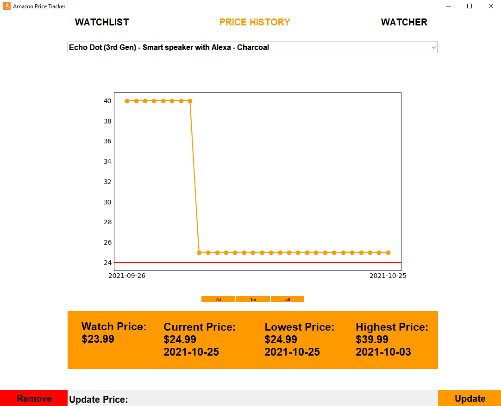
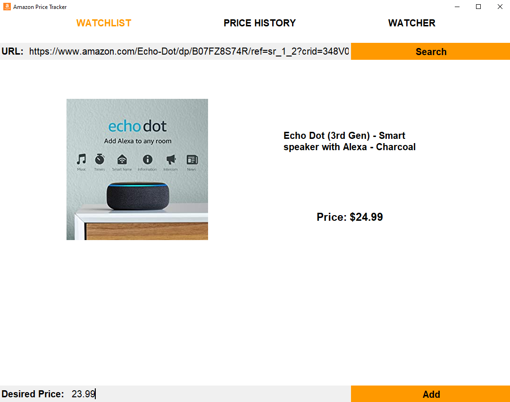
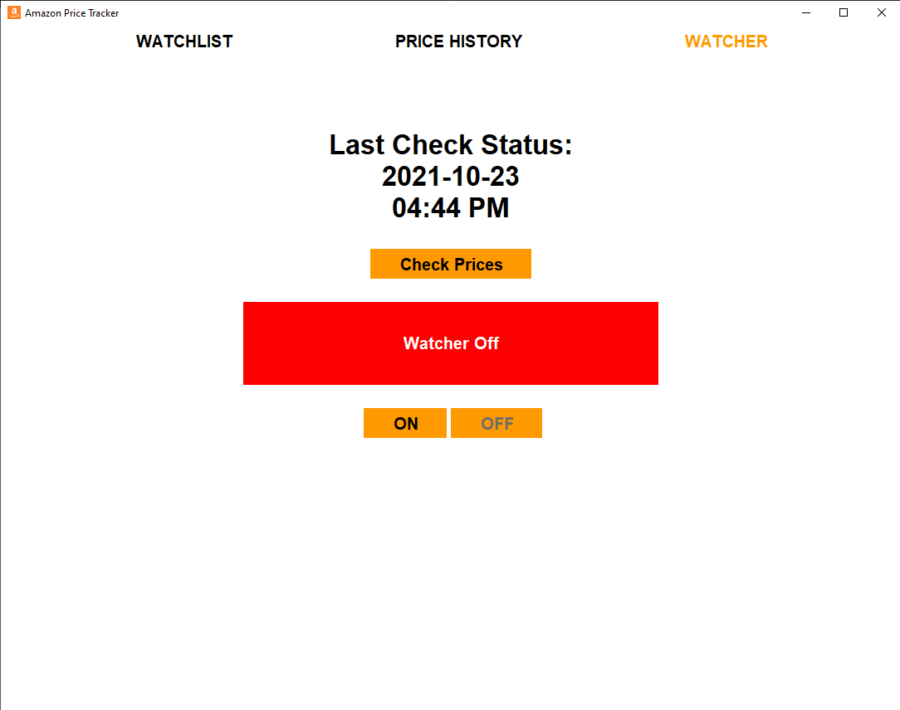

<div id="top"></div>

# Amazon Python Price Tracker

<br />

<details>
  <summary>Table of Contents</summary>
  <ol>
    <li>
      <a href="#about-the-project">About The Project</a>
    </li>
    <li>
        <a href="#technologies-used">Technologies Used</a>
    </li>
    <li>
      <a href="#installation">Installation</a>
    </li>
    <li><a href="#usage">Usage</a></li>
    <li><a href="#roadmap">Roadmap</a></li>
  </ol>
</details>

<br />

## About The Project
<br />


Amazon Python Price Tracker is a desktop utility to help track multiple product price points at the same time. This application lets you preview the product with the given url, add a watch price, and see the price history of a given item. 

<br />



<br />
<br />



<br />
<br />



## Technologies Used
* [beautifulsoup4](https://pypi.org/project/beautifulsoup4/)
* [matplotlib](https://pypi.org/project/matplotlib/)
* [pandas](https://pypi.org/project/pandas/)
* [requests](https://pypi.org/project/requests/)
* [user_agent](https://pypi.org/project/user_agent/)

## Installation

#### Clone the GIT repository.  
```bash
git clone https://github.com/MrSaifman/AmazonPriceTracker
```
(Update Soon)   
## Usage
(Update Soon)
## Roadmap
(Update Soon)

<p align="right">(<a href="#top">back to top</a>)</p>